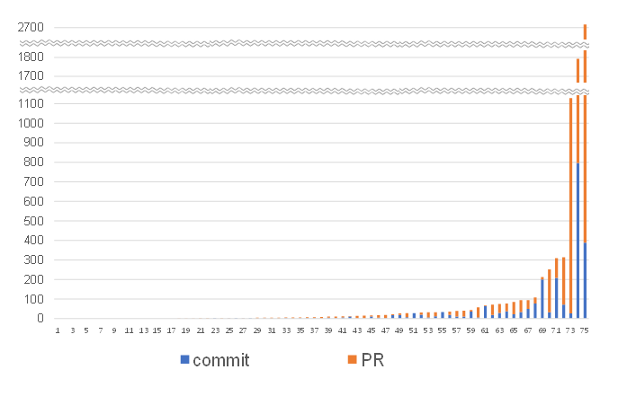

# 소개
본 repository는 2023 한국소프트웨어종합학술대회(KSC 2023)에 등재된 논문 "오픈소스 소프트웨어 프로젝트를 대상으로 한 MISRA C 코딩 가이드라인 적용 실태 조사"에서 언급한 data에 대해서 프로젝트별로 분류된 자세한 data를 공개하고자 한다.

논문에서 언급한 총 75개의 C 프로젝트 조사대상에 대해서 조사한 data를 각 RQ별로 공개한다.

2023년 10월 30일을 기준으로 github에서 검색한 내용을 바탕으로 data를 수집하였다.

## RQ1: MISRA C 코딩 가이드라인을 적용하는 프로젝트는 어떠한 주제(도메인)의 프로젝트 인가?
<표 1. MISRA 코딩 가이드라인이 적용된 프로젝트의 주제>
| 분류 | 대표적 연관 키워드 | 프로젝트 수 |
| --  | -- | -- |
| firmware | microcontroller, device driver | 24 |
| OS | RTOS, file system | 13 |
| critical app. | medical, automotive | 10 |
| app. library | utility, data structure | 9 |
| middleware | IoT, application protocol | 7 |
| math. library | math, cryptography | 5 |
| application | game, robot | 5 |
| 미분류 | - | 2 |

detailed data link: [table1.md](./table1.md)   

표1의 경우 75개 조사대상 프로젝트 repository에서 해당 프로젝트를 가장 잘 나타내는 keyword를 선정하고 선정된 keyword를 통해 8가지로 분류한 data이다.

[table1.md](./table1.md)에서는 각 프로젝트에 대해서 어떤 keyword를 선정하였는지, 그에 따른 분류는 무엇인지 설명하고 있다.

## RQ2: MISRA C 코딩 가이드라인을 적용한 프로젝트의 저장소에서 코딩 가이드라인으로 인한 코드 변경을 찾을 수 있는가?
<그림 1. 프로젝트별 MISRA 관련 commit과 pull request 개수>

detailed data link: [figure1.md](./figure1.md)   

그림 1의 경우 75개 조사대상에 대해서 "MISRA", "rule", "guideline"이라는 키워드가 언급된 commit, PRs의 총 개수를 histogram으로 정리한 data이다.

[figure1.md](./figure1.md)에서는 각 프로젝트에서 "MISRA", "rule", "guideline"이라는 키워드가 언급된 commit, PRs 총 개수를 보여준다.

각 프로젝트에서 키워드 "MISRA", "rule", "guideline"으로 검색해서 나온 결과를 data로 수집하였다.

## RQ3: MISRA C 코딩 가이드라인을 적용하는 프로젝트에서는 정적 검사기를 사용하여 규칙 만족 여부를 검사하는가?
<표 2. MISRA C 정적검사기를 사용하는 프로젝트 수>
|	도구	|	자동	|	수동	|	미상	|	합계	|
|	-	|	-	|	-	|	-	|	-	|
|	cppcheck	|	9	|	7	|	3	|	19	|
|	coverity	|	1	|	4	|	7	|	12	|
|	Clang-tidy	|	5	|	0	|	1	|	6	|
|	SonarCloud	|	4	|	0	|	1	|	5	|
|	CodeQL	|	5	|	0	|	0	|	5	|
|	PC Lint	|	0	|	1	|	4	|	5	|
|	pvs-studio-analyzer	|	1	|	1	|	1	|	3	|
|	SonarQube	|	1	|	0	|	1	|	2	|
|	IAR EWARM	|	1	|	0	|	1	|	2	|
|	clang-format	|	1	|	0	|	1	|	2	|
|	parasoft	|	0	|	0	|	1	|	1	|
|	Codacy	|	0	|	0	|	1	|	1	|
|	axivion suite	|	1	|	0	|	0	|	1	|
|	CMSIS_MISRA	|	0	|	0	|	1	|	1	|
|	TscanCode	|	0	|	0	|	1	|	1	|
|	clang-analyzer	|	0	|	1	|	0	|	1	|
|	codechecker	|	0	|	1	|	0	|	1	|
|	sparse	|	0	|	1	|	0	|	1	|

detailed data link: [table2.md](./table2.md)   

표2의 경우 75개 조사대상 프로젝트 repository에서 사용하고 있다고 언급하거나 사용하는 것으로 보이는 정적 검사기를 조사하였고 그 사용 방법에 따라 분류한 data이다.

[table2.md](./table2.md)에서는 각 프로젝트에서 사용하고 있는 정적검사기가 무엇인지, 어떤 방법으로 사용하고 있는지 설명하고 있다.

각 프로젝트 프로젝트 repository를 살펴보고 다음과 같은 기준으로 분류를 진행하였다.
- 빌드 과정이나 특정 주기나 commit push할 때 검사를 진행하는 등 수동으로 검사를 진행하지 않는 경우 자동으로 분류하였다.
- 정적 분석기를 사용할 수 있는 command를 제공하거나 프로젝트에 정적 분석기를 사용할 수 있는 script를 제공하고 있는 경우 수동으로 분류하였다.
- 코드 comment나 issue, commit, PRs에서 정적 분석기에 대한 언급이 있고 검사한 기록은 찾을 수 있지만 어떤 방법으로 검사를 진행했는지 알 수 없는 경우 미상으로 분류하였다.

## RQ4: MISRA C 코딩 가이드라인 중 어떠한 규칙을 조사대상 프로젝트에서는 준수하고 있는가?
<표3. MISRA C 정적검사기를 사용하는 프로젝트 수>
|	Rule	|	#	|	Rule	|	#	|	Rule	|	#	|	Rule	|	#	|	Rule	|	#	|
|	-	|	-	|	-	|	-	|	-	|	-	|	-	|	-	|	-	|	-	|
|	2.2	|	3	|	8.4	|	2	|	11.3	|	3	|	14.4	|	6	|	18.4	|	2	|
|	2.4	|	1	|	8.6	|	3	|	11.4	|	2	|	15.1	|	1	|	18.7	|	1	|
|	2.5	|	2	|	8.7	|	3	|	11.5	|	3	|	15.2	|	2	|	18.8	|	1	|
|	2.7	|	2	|	8.8	|	2	|	11.6	|	1	|	15.4	|	4	|	19.1	|	1	|
|	3.1	|	4	|	8.9	|	2	|	11.7	|	1	|	15.5	|	3	|	19.2	|	4	|
|	5.1	|	1	|	8.11	|	1	|	11.8	|	3	|	15.6	|	4	|	20.1	|	3	|
|	5.2	|	3	|	8.13	|	3	|	11.9	|	3	|	15.7	|	4	|	20.7	|	4	|
|	5.3	|	1	|	9.1	|	2	|	12.1	|	5	|	16.1	|	2	|	20.9	|	1	|
|	5.4	|	3	|	10.1	|	3	|	12.2	|	3	|	16.3	|	3	|	20.13	|	1	|
|	5.5	|	1	|	10.2	|	1	|	12.3	|	3	|	16.4	|	2	|	21.1	|	2	|
|	5.7	|	1	|	10.3	|	4	|	13.1	|	1	|	16.5	|	1	|	21.2	|	1	|
|	5.8	|	2	|	10.4	|	11	|	13.2	|	1	|	16.6	|	2	|	21.6	|	2	|
|	6.1	|	2	|	10.5	|	2	|	13.3	|	4	|	16.7	|	2	|	21.8	|	1	|
|	7.2	|	3	|	10.6	|	3	|	13.4	|	4	|	17.2	|	2	|	21.15	|	3	|
|	7.3	|	1	|	10.7	|	3	|	13.5	|	1	|	17.7	|	6	|	21.16	|	3	|
|	7.4	|	2	|	10.8	|	7	|	14.2	|	4	|	17.8	|	1	|	21.18	|	1	|
|	8.2	|	2	|	11.2	|	2	|	14.3	|	4	|	18.3	|	1	|	22.1	|	1	|
|	8.3	|	5	|		|		|		|		|		|		|		|		|

detailed data link: [table3.md](./table3.md)   

표3의 경우 75개 조사대상 프로젝트 repository에서 준수하는 것으로 보이는 MISRA 가이드라인 Rule에 대해서 조사한 data이다. 각 Rule 별로 해당 Rule을 commit, PRs에서 언급하고 있는 프로젝트 개수를 정리하였다. 

[table3.md](./table3.md)에서 각 프로젝트에서 언급하고 있는 MISRA rule 총 개수와 어떤 rule을 언급하고 있는지 정리하였다. 각 프로젝트에서 어떤 Rule에 대한 fix case를 확보할 수 있는지 확인할 수 있다.
